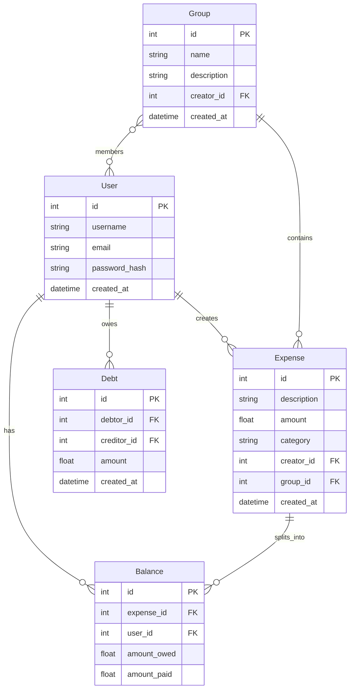

# 💰 Xchange

> **An expense-sharing web application built with Flask** 🚀

A pet project designed to consolidate Python, Flask, and SQL integration skills through real-world application development. This expense-sharing platform demonstrates modern web development practices, database design, and full-stack implementation while providing a practical tool for managing shared expenses with friends and groups.

[](https://python.org)
[](https://flask.palletsprojects.com/)

---

## ✨ Features

### 💸 **Expense Management**
- **Flexible Splitting**: Split expenses equally, by custom amounts, or by percentages
- **Multiple Categories**: Organize expenses by category (Food, Travel, Utilities, etc.)
- **Real-time Calculations**: Instant balance updates and debt tracking

### 👥 **Group Management**
- **Create Groups**: Organize expenses by groups (trips, roommates, projects)
- **Group Overview**: Visual dashboards showing balances and recent activity

### 🤝 **Social Features**
- **User Profiles**: Manage your account and view your expense history
- **Activity Feed**: Track all expense activities and updates

### 💰 **Debt Settlement**
- **Smart Calculations**: Automatic debt optimization to minimize transactions
- **Settlement Tracking**: Mark debts as settled with confirmation
- **Balance Overview**: Clear view of who owes what to whom

### 🔒 **Security & Reliability**
- **User Authentication**: Secure login and registration system
- **Data Validation**: Comprehensive form validation and error handling
- **Database Integrity**: Robust data models with proper relationships

---

## 🚀 Quick Start

### Local Development
```bash
# Clone and setup
git clone <your-repo-url>
cd Xchange

# Create virtual environment
python -m venv venv
source venv/bin/activate  # On Windows: venv\Scripts\activate

# Install dependencies
pip install -r requirements.txt

# Initialize database
flask database create-tables

# Run the application
python runserver.py
```

---

## 🏗️ Architecture

### **Tech Stack**
```
🐍 Backend Framework    → Flask 3.1.0
🗄️ Database           → SQLite / PostgreSQL
🎨 Frontend           → Jinja2 Templates + Vanilla JS
🔐 Authentication     → Flask-Login
📝 Forms              → WTForms + Flask-WTF
🔄 Migrations         → Flask-Migrate (Alembic)
```

### **Project Structure**
```
Xchange/
├── 🔧 Application Core
│   ├── app/
│   │   ├── __init__.py         # App factory
│   │   ├── config.py           # Configuration classes
│   │   └── database.py         # Database setup
│   │
│   ├── 🔐 Authentication (app/auth/)
│   │   ├── views.py            # Login, logout, registration
│   │   └── forms.py            # Auth forms
│   │
│   ├── 👤 User Management (app/user/)
│   │   ├── views.py            # Dashboard, friends, profile
│   │   └── forms.py            # User forms
│   │
│   ├── 👥 Group Management (app/group/)
│   │   ├── views.py            # Groups, members, overview
│   │   └── forms.py            # Group forms
│   │
│   ├── 💰 Expense Management (app/expense/)
│   │   ├── views.py            # Create, view expenses
│   │   ├── forms.py            # Expense forms
│   │   ├── mapper.py           # Data transformation
│   │   └── submit.py           # Expense processing
│   │
│   ├── 🔢 Splitting Logic (app/split/)
│   │   ├── equally.py          # Equal split algorithm
│   │   ├── amount.py           # Custom amount splits
│   │   └── percentage.py       # Percentage-based splits
│   │
│   ├── 💳 Debt Management (app/debt/)
│   │   └── __init__.py         # Debt calculations
│   │
│   └── 🗃️ Data Models (app/model/)
│       ├── user.py             # User model
│       ├── group.py            # Group model
│       ├── expense.py          # Expense model
│       ├── balance.py          # Balance model
│       └── debt.py             # Debt model
│
├── 🎨 Frontend (app/templates/)
│   ├── auth/                   # Login, registration pages
│   ├── user/                   # Dashboard, profile pages
│   ├── group/                  # Group management pages
│   └── expense/                # Expense forms and summaries
│
├── 🧪 Tests (tests/)
│   ├── auth/                   # Authentication tests
│   ├── user/                   # User feature tests
│   ├── group/                  # Group feature tests
│   ├── expense/                # Expense feature tests
│   └── model/                  # Data model tests
│
└── 📚 Documentation
    ├── README.md               # This file
    └── CLAUDE.md              # Development instructions
```

---

## 🎯 Usage Examples

### Creating an Expense
```python
# Example: Dinner for 4 people, split equally
Expense(
    description="Dinner at Italian Restaurant",
    amount=120.00,
    category="Food",
    payers=[user1],           # Who paid
    owers=[user1, user2, user3, user4],  # Who owes
    split_type="Equally"      # How to split
)
# Result: Everyone owes $30
```

### Custom Split Example
```python
# Example: Unequal split by amount
Expense(
    description="Vacation Rental",
    amount=400.00,
    payers=[user1],
    owers=[user1, user2, user3],
    split_type="Amount",
    amounts={
        user1: 200.00,  # Gets larger room
        user2: 100.00,  # Standard room
        user3: 100.00   # Standard room
    }
)
```

---

## 🧪 Testing

### Run All Tests
```bash
# With pytest
pytest

# With coverage
pytest --cov

# Specific test modules
pytest tests/expense/
pytest tests/user/
```

### Test Categories
- **Unit Tests**: Model logic, splitting algorithms
- **Integration Tests**: View functions, form handling
- **Feature Tests**: End-to-end user workflows

---

## 🛠️ Development

### Prerequisites
- Python 3.13+
- SQLite (included) or PostgreSQL

### Development Commands
```bash
# Database operations
flask database create-tables    # Create all tables
flask database clear-data       # Clear all data
flask database test-data        # Create test data

# Database migrations
flask db migrate -m "message"   # Create migration
flask db upgrade                # Apply migrations

# Code quality
black .                         # Format code
mypy .                          # Type checking
pytest                          # Run tests
```

### Contributing
1. Fork the repository
2. Create a feature branch (`git checkout -b feature/amazing-feature`)
3. Make your changes
4. Add tests for new functionality
5. Run the test suite (`pytest`)
6. Commit your changes (`git commit -m 'Add amazing feature'`)
7. Push to the branch (`git push origin feature/amazing-feature`)
8. Open a Pull Request

---

## 📊 Database Schema



---

## 🎨 Screenshots

### Dashboard

*Clean, intuitive dashboard showing your expenses and balances*

### Expense Form

*Flexible expense creation with multiple split options*

### Group Overview

*Comprehensive group management with member balances*

---

## 🤝 Contributing

We welcome contributions! Here's how you can help:

- 🐛 **Report Bugs**: Open an issue with details
- 💡 **Suggest Features**: Share your ideas for improvements
- 🔧 **Submit PRs**: Fix bugs or add new features
- 📚 **Improve Docs**: Help make our documentation better
- 🧪 **Add Tests**: Increase our test coverage

---

## 📄 License

This project is licensed under the MIT License - see the [LICENSE](LICENSE) file for details.

---

<p align="center">
  Made with ❤️ by <a href="https://github.com/your-username">Your Name</a>
</p>

<p align="center">
  <a href="#-xchange">⬆️ Back to Top</a>
</p>